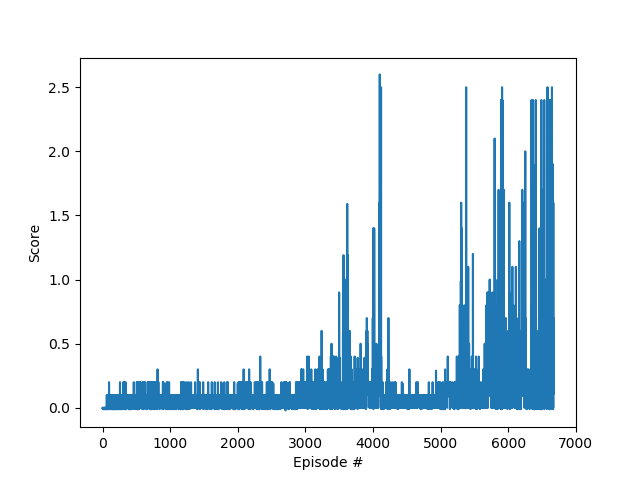

# Project 3 - Continuous Control of Collaborative Multiple Agents Using Deep Deterministic Policy Gradients (DDPG) - Implementation Report

## Introduction

In this report we describe the implementation of the reinforcement learning technique known as Deep Deterministic Policy Gradients (DDPG), used to solve a continuous control problem with multiple agents. Please refer to file `README.md` for a complete description of the specific problem/environment. 

Our solution uses a standard Deep Deterministic Policy Gradients (DDPG) implementation as described in the original [research paper](https://arxiv.org/pdf/1509.02971.pdf). We concatenate the state observed by each agent and make the same network produce actions for both, i.e., we treat the two agents as a single, more complex agent.  

The implementation is a slightly modified version of the one provided as an exercise in the course; our contribution is restricted to adaptation to the specific problem/environment, hyperparameters fine-tuning, and the addition of a mechanism (epsilon decay) to reduce the impact of Ornstein-Uhlenbeck noise in later training episodes, as suggested in discussions with other students in the course.  

## Reinforcement Learning

In a Reinforcement Learning problem an *agent* observes the *state* _s(t)_ of an *environment* in a given moment of time, and chooses an *action* _a(t)_. Since this is a continuous control problem, the action consists in a vector where each dimension is continuous. When executed the action changes the environment moving it to a new state _s(t+1)_, and the action receives a *reward* _r(t+1)_. The objective of the agent is maximize the reward received after multiple interactions with the environment. In order to achieve this goal the agent must *explore* the environment in  order to find out the best actions given the state, and also to *exploit* the acquired knowledge to collect the rewards. As training progresses, the amount of *exploration* must be reduced, above all in deterministic environments. 

## Deep Deterministic Policy Gradients

A *policy* is a function that gives the probability of choosing an action _a_ when observing a state _s_. The *optimal policy* is the one that maximizes the estimated reward obtained when following the policy. 

In Q-learning the agent tries to find the optimal action-value function Q, which maps a (state,action) pair to the estimated reward obtained when following the optimal policy. If the environment state is discrete, the action-value function Q can be represented as a table.

If the environment state is continuous, we need to approximate the action-value function Q. This can be done using a neural network as a non-linear function approximator, adjusting its weights according to the observed rewards. 

If the actions are continuous, standard Q-Learning cannot be used. DDPG solves this limitation by training two separate networks: the Actor approximates the optimal policy deterministically (i.e. approximating the _argmax(Q(s,a)_. The second, network, estimates the value of each state.  

### Neural Network Architecture 

In our implementation, we use two neural network composed by two 128-node hidden Linear layers. 

The input layer of of both networks has 16 nodes, 8 for each agent, corresponding to the dimension of the environment state observed by them. 

The output of the *Actor* network uses a _tanh_ layer with 4 nodes, 2 for each agent, to provide values between -1 and 1 for each of dimension of the action vector. 

The *Critic* network uses a Rectified Linear Unit (ReLU) at its output, to estimate the value of each state. 


### Experience Replay and Soft Updates

In order to minimize the correlation between samples we use Experience Replay, as originally proposed in [Human-level control through deep reinforcement learning](https://storage.googleapis.com/deepmind-media/dqn/DQNNaturePaper.pdf): past observations _(s, a, s(t+1), r(t+1))_ are stored in a replay circular buffer, from where random observations are sampled to update the network. 

Another improvement from thei original DDPG paper is the use of soft updates: weight updates are performed in a separate network, which is merged after each step using a weight (tau) that prioritizes the value of the target network. This helps reducing the correlation between the target and current Q values, and is used in both the Actor and Critic networks.

We also use gradient normalization, and a parameter (epsilon decay) to reduce the noise introduced by the Ornstein-Uhlenbeck process as training progresses. Without this change the performance of trained agents was degraded by the noise, because the environment is very deterministic. 

### Hyperparameters

The hyperparameters used in our implementation were the following:

Name                            |    Value
--------------------------------|----------------------
Replay Buffer Size              | 1e5
Minibatch size                  | 512 
Discount Factor (Gamma)         | 0.99 
Tau (for soft update of target parameters) | 2e-1
Learning Rate (Actor)                             | 1e-3
Learning Rate (Critic)                             | 5e-4
Maixmum number of training episodes        | 10000
Maximum number of timesteps per episode    | 10000
Starting value of epsilon for action selection | 1.0
Minimum value of epsilon                   |  0.0
Epsilon decay                              | 1e-6

## Results

DDPG was able to solve the problem by achieving an average score of *+0.5* over 100 consecutive episodes, in 6570 training training episodes. 

```
Episode 100 Score: 0.00000000, Average Score: 0.00410000, Max: 0.20000000, Min: -0.01000000, Time: 0.72558260
Episode 200 Score: 0.00000000, Average Score: 0.01880000, Max: 0.20000000, Min: -0.01000000, Time: 0.70358133
Episode 300 Score: 0.00000000, Average Score: 0.03170000, Max: 0.20000000, Min: -0.01000000, Time: 0.75654554
Episode 400 Score: -0.01000000, Average Score: 0.03660000, Max: 0.20000000, Min: -0.01000000, Time: 0.68063879
Episode 500 Score: 0.00000000, Average Score: 0.03880000, Max: 0.20000000, Min: -0.01000000, Time: 0.64862609
Episode 600 Score: -0.01000000, Average Score: 0.04450000, Max: 0.20000000, Min: -0.01000000, Time: 1.54610825
Episode 700 Score: 0.00000000, Average Score: 0.05390000, Max: 0.20000000, Min: -0.01000000, Time: 0.74156928
Episode 800 Score: 0.00000000, Average Score: 0.06160000, Max: 0.20000000, Min: -0.01000000, Time: 0.68458438
Episode 900 Score: 0.10000000, Average Score: 0.06950000, Max: 0.30000000, Min: -0.01000000, Time: 1.58304596
Episode 1000 Score: 0.10000000, Average Score: 0.06230000, Max: 0.30000000, Min: -0.01000000, Time: 1.57705474
Episode 1100 Score: 0.10000000, Average Score: 0.05870000, Max: 0.30000000, Min: -0.01000000, Time: 1.76895046
Episode 1200 Score: 0.00000000, Average Score: 0.05640000, Max: 0.30000000, Min: -0.01000000, Time: 0.70560265
Episode 1300 Score: 0.00000000, Average Score: 0.05490000, Max: 0.30000000, Min: -0.01000000, Time: 0.77054477
Episode 1400 Score: -0.01000000, Average Score: 0.06270000, Max: 0.30000000, Min: -0.01000000, Time: 0.63860941
Episode 1500 Score: 0.10000000, Average Score: 0.05550000, Max: 0.30000000, Min: -0.01000000, Time: 1.63604188
Episode 1600 Score: 0.09000000, Average Score: 0.05310000, Max: 0.30000000, Min: -0.01000000, Time: 4.28750062
Episode 1700 Score: 0.00000000, Average Score: 0.06790000, Max: 0.30000000, Min: -0.01000000, Time: 0.76955056
Episode 1800 Score: 0.20000000, Average Score: 0.06700000, Max: 0.30000000, Min: -0.01000000, Time: 3.41804123
Episode 1900 Score: 0.10000000, Average Score: 0.06600000, Max: 0.30000000, Min: -0.01000000, Time: 1.58508205
Episode 2000 Score: 0.10000000, Average Score: 0.07100000, Max: 0.30000000, Min: -0.01000000, Time: 1.70301247
Episode 2100 Score: 0.10000000, Average Score: 0.07850000, Max: 0.30000000, Min: -0.01000000, Time: 1.67303085
Episode 2200 Score: 0.10000000, Average Score: 0.08910000, Max: 0.30000000, Min: -0.01000000, Time: 1.63505316
Episode 2300 Score: 0.10000000, Average Score: 0.07420000, Max: 0.30000000, Min: -0.01000000, Time: 1.85492730
Episode 2400 Score: 0.10000000, Average Score: 0.09130000, Max: 0.40000001, Min: -0.01000000, Time: 2.69136238
Episode 2500 Score: 0.10000000, Average Score: 0.08770000, Max: 0.40000001, Min: -0.01000000, Time: 1.77097702
Episode 2600 Score: 0.10000000, Average Score: 0.08550000, Max: 0.40000001, Min: -0.01000000, Time: 1.63106728
Episode 2700 Score: 0.20000000, Average Score: 0.07430000, Max: 0.40000001, Min: -0.01000000, Time: 3.45500803
Episode 2800 Score: 0.10000000, Average Score: 0.08400000, Max: 0.40000001, Min: -0.02000000, Time: 1.49709368
Episode 2900 Score: 0.00000000, Average Score: 0.07610000, Max: 0.40000001, Min: -0.02000000, Time: 0.69957566
Episode 3000 Score: 0.00000000, Average Score: 0.07340000, Max: 0.40000001, Min: -0.02000000, Time: 0.73256278
Episode 3100 Score: 0.10000000, Average Score: 0.08940000, Max: 0.40000001, Min: -0.02000000, Time: 1.64802551
Episode 3200 Score: 0.10000000, Average Score: 0.09970000, Max: 0.40000001, Min: -0.02000000, Time: 2.28965807
Episode 3300 Score: 0.10000000, Average Score: 0.11410000, Max: 0.60000001, Min: -0.02000000, Time: 3.08819699
Episode 3400 Score: 0.00000000, Average Score: 0.09830000, Max: 0.60000001, Min: -0.02000000, Time: 0.67560601
Episode 3500 Score: 0.90000001, Average Score: 0.11830000, Max: 0.90000001, Min: -0.02000000, Time: 19.18186045
Episode 3600 Score: 0.00000000, Average Score: 0.11180000, Max: 1.19000002, Min: -0.02000000, Time: 0.75456381
Episode 3700 Score: 0.00000000, Average Score: 0.12140000, Max: 1.59000002, Min: -0.02000000, Time: 0.69161081
Episode 3800 Score: 0.00000000, Average Score: 0.08350000, Max: 1.59000002, Min: -0.02000000, Time: 0.76753831
Episode 3900 Score: 0.10000000, Average Score: 0.10320000, Max: 1.59000002, Min: -0.02000000, Time: 1.61106777
Episode 4000 Score: 0.10000000, Average Score: 0.13990000, Max: 1.59000002, Min: -0.02000000, Time: 2.54251361
Episode 4100 Score: 0.10000000, Average Score: 0.15730000, Max: 1.60000002, Min: -0.02000000, Time: 1.72300744
Episode 4200 Score: 0.10000000, Average Score: 0.14940000, Max: 2.60000004, Min: -0.02000000, Time: 1.62004757
Episode 4300 Score: 0.00000000, Average Score: 0.08320000, Max: 2.60000004, Min: -0.02000000, Time: 0.68160057
Episode 4400 Score: 0.10000000, Average Score: 0.05760000, Max: 2.60000004, Min: -0.02000000, Time: 1.59107208
Episode 4500 Score: 0.10000000, Average Score: 0.05870000, Max: 2.60000004, Min: -0.02000000, Time: 1.65702868
Episode 4600 Score: 0.00000000, Average Score: 0.06460000, Max: 2.60000004, Min: -0.02000000, Time: 1.01640320
Episode 4700 Score: 0.10000000, Average Score: 0.06980000, Max: 2.60000004, Min: -0.02000000, Time: 1.58408141
Episode 4800 Score: 0.10000000, Average Score: 0.06870000, Max: 2.60000004, Min: -0.02000000, Time: 1.66403604
Episode 4900 Score: 0.00000000, Average Score: 0.05740000, Max: 2.60000004, Min: -0.02000000, Time: 0.72357535
Episode 5000 Score: 0.10000000, Average Score: 0.07240000, Max: 2.60000004, Min: -0.02000000, Time: 2.71243310
Episode 5100 Score: 0.20000000, Average Score: 0.07960000, Max: 2.60000004, Min: -0.02000000, Time: 4.40644646
Episode 5200 Score: -0.01000000, Average Score: 0.09930000, Max: 2.60000004, Min: -0.02000000, Time: 2.96428418
Episode 5300 Score: 0.99000002, Average Score: 0.13310000, Max: 2.60000004, Min: -0.02000000, Time: 22.53696561
Episode 5400 Score: 0.00000000, Average Score: 0.19760000, Max: 2.60000004, Min: -0.02000000, Time: 0.68260217
Episode 5500 Score: 0.30000000, Average Score: 0.09170000, Max: 2.60000004, Min: -0.02000000, Time: 6.50956702
Episode 5600 Score: 0.00000000, Average Score: 0.07070000, Max: 2.60000004, Min: -0.02000000, Time: 0.66161084
Episode 5700 Score: 0.10000000, Average Score: 0.13590000, Max: 2.60000004, Min: -0.02000000, Time: 1.61906600
Episode 5800 Score: 2.10000003, Average Score: 0.25170000, Max: 2.60000004, Min: -0.02000000, Time: 44.44439530
Episode 5900 Score: 0.10000000, Average Score: 0.26670000, Max: 2.60000004, Min: -0.02000000, Time: 1.78496575
Episode 6000 Score: 0.20000000, Average Score: 0.33810001, Max: 2.60000004, Min: -0.02000000, Time: 5.44885850
Episode 6100 Score: 0.10000000, Average Score: 0.19200000, Max: 2.60000004, Min: -0.02000000, Time: 1.70699883
Episode 6200 Score: 0.50000001, Average Score: 0.18310000, Max: 2.60000004, Min: -0.02000000, Time: 10.04021454
Episode 6300 Score: 0.10000000, Average Score: 0.28520000, Max: 2.60000004, Min: -0.02000000, Time: 1.61507273
Episode 6400 Score: 0.30000000, Average Score: 0.22060000, Max: 2.60000004, Min: -0.02000000, Time: 6.68115425
Episode 6500 Score: 0.10000000, Average Score: 0.24150000, Max: 2.60000004, Min: -0.02000000, Time: 1.93284440
Episode 6600 Score: 0.79000001, Average Score: 0.31870000, Max: 2.60000004, Min: -0.02000000, Time: 17.46969390

Environment solved in 6570 episodes!    Average Score: 0.50110001

```



## Ideas for Future Work

Our solution uses a single DDPG instance to control both agents; effectively each agent has access to the observation of the other one, allowing them to collaborate better. A different solution could avoid this, keeping each agent observation private and training a different Actor for each agent, and sharing only the Critic. We believe such solution would be more realistic but more difficult to converge.

Going further: the most time-consuming part of this work was hyperparameter tuning. One idea to improve this is to use techniques for selecting them automatically, for example implementing a *grid search* or using a *genetic algorithm* to find the best set of parameters. 

